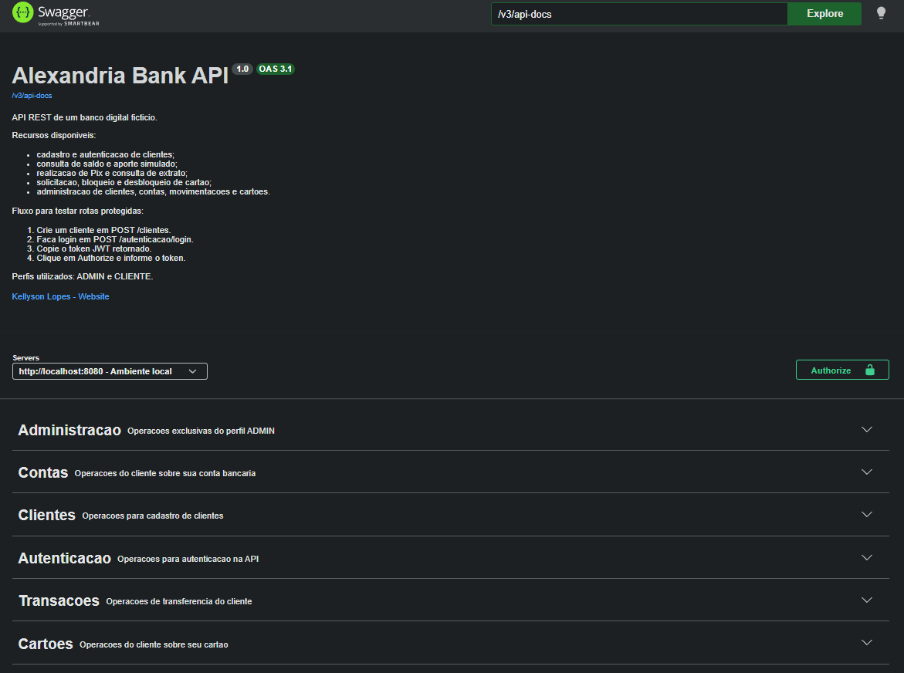

# Alexandria Bank

O Alexandria Bank é uma API REST de um banco digital fictício criada para estudar desenvolvimento de software além da escrita de código.

O projeto parte das dores e necessidades dos usuários para entender o problema antes de escolher uma solução. A partir disso, são definidas jornadas, requisitos e regras de negócio. As entidades surgem desse processo: cliente, conta, transação e cartão representam conceitos identificados no funcionamento do sistema, e não apenas tabelas do banco de dados.

A proposta é praticar como um sistema real começa a ser modelado e evolui: entender quem usa a aplicação, o que essa pessoa precisa fazer, quais regras protegem cada operação e como distribuir responsabilidades entre os componentes. A implementação segue um monólito organizado por domínio, preparando limites mais claros entre as partes do sistema sem antecipar complexidades desnecessárias.

Escolhi o contexto bancário para experimentar esses conceitos em um domínio que exige atenção a segurança, autorização, estados, movimentações financeiras e consistência dos dados.

## Swagger



## Documentação do processo

Os materiais usados antes e durante a implementação estão na pasta [`docs`](docs):

- objetivo e problema;
- requisitos dos clientes e administradores;
- jornadas dos usuários;
- domínios e responsabilidades;
- regras de negócio e modelagem.

Com a aplicação em execução, a documentação dos endpoints está disponível no Swagger UI em `http://localhost:8080/swagger-ui.html`.

## Tecnologias

Java 17, Spring Boot, Spring MVC, Spring Data JPA, Spring Security, JWT, PostgreSQL, Flyway, Bean Validation e OpenAPI/Swagger.

## Como executar localmente

Tenha o Java 17 e o PostgreSQL instalados, crie um banco de dados e configure as variáveis de ambiente:

```env
DB_URL=jdbc:postgresql://localhost:5432/alexandria_bank
DB_USERNAME=postgres
DB_PASSWORD=sua_senha
JWT_SECRET=uma_chave_secreta_com_pelo_menos_32_caracteres
```

Depois, execute:

```bash
./mvnw spring-boot:run
```

No Windows:

```powershell
.\mvnw.cmd spring-boot:run
```

As migrations serão aplicadas automaticamente pelo Flyway. A API ficará disponível em `http://localhost:8080`.
