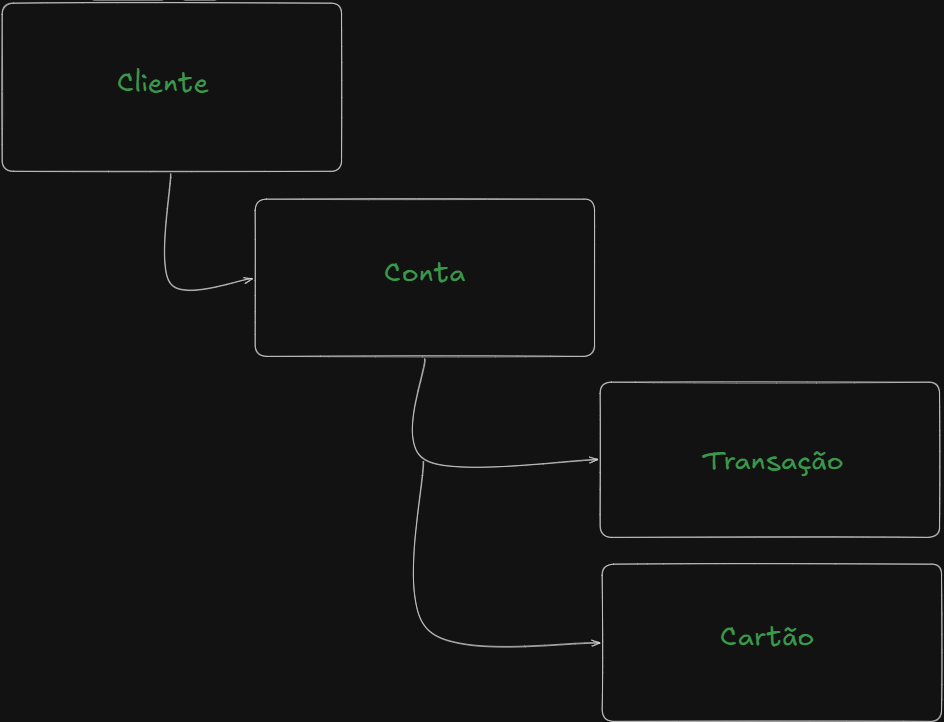

# 05 - Modelagem Inicial

## Como pensei a modelagem

No meu modelo, eu pensei primeiro em quais dados cada parte do sistema precisa guardar.

Como o projeto ainda é um MVP, tentei manter apenas os dados mais importantes e evitar detalhes que ainda não são necessários.

## Cliente

Para o cliente, pensei nos dados necessários para identificar a pessoa e permitir o acesso ao sistema.

### Dados

- id
- nome
- cpf
- email
- senha

### Regras que pensei

- Cada cliente precisa ter um identificador.
- O CPF não pode ser repetido.
- O email não pode ser repetido.
- Cada cliente terá uma conta neste MVP.

## Conta

Para a conta, pensei nos dados necessários para controlar o saldo e ligar a conta ao cliente.

### Dados

- id
- saldo
- status
- cliente

### Regras que pensei

- Cada conta precisa ter um identificador.
- A conta deve pertencer a um cliente.
- O saldo começa em zero.
- O saldo não pode ficar negativo.
- A conta pode ter várias transações.
- A conta pode ter um cartão.

## Transação

Para a transação, pensei nos dados necessários para registrar o dinheiro que entra ou sai da conta.

### Dados

- id
- valor
- tipo
- data
- descrição
- conta

### Regras que pensei

- Cada transação precisa ter um identificador.
- Toda transação deve pertencer a uma conta.
- O valor precisa ser maior que zero.
- O tipo deve mostrar se o dinheiro entrou ou saiu.
- Uma saída só pode acontecer se houver saldo suficiente.
- As transações precisam ficar salvas para formar o extrato.

## Cartão

Para o cartão, pensei nos dados necessários para identificar o cartão e controlar seu estado.

### Dados

- id
- número
- nome impresso
- data de validade
- código de segurança
- status
- data de solicitação
- conta

### Regras que pensei

- Cada cartão precisa ter um identificador.
- O cartão deve pertencer a uma conta.
- Neste MVP, cada conta terá apenas um cartão.
- O número do cartão deve ser único.
- Quando o cartão for solicitado, ele terá um status inicial.
- Quando for bloqueado, o status deve ser alterado.

## Relacionamentos

No meu modelo, pensei nesta relação:

